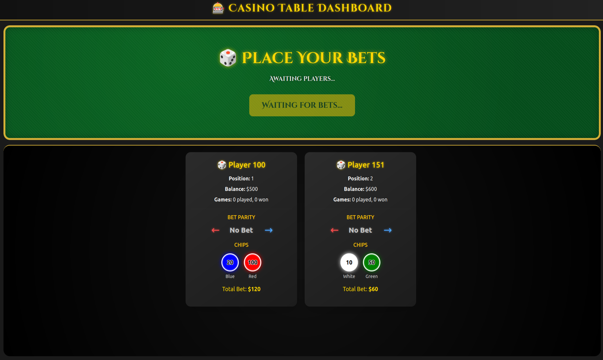
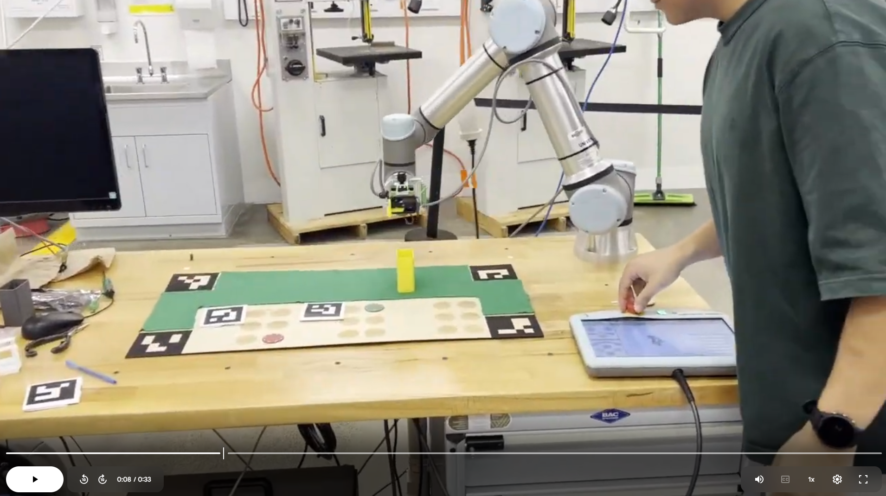
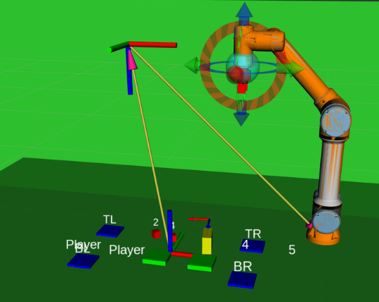
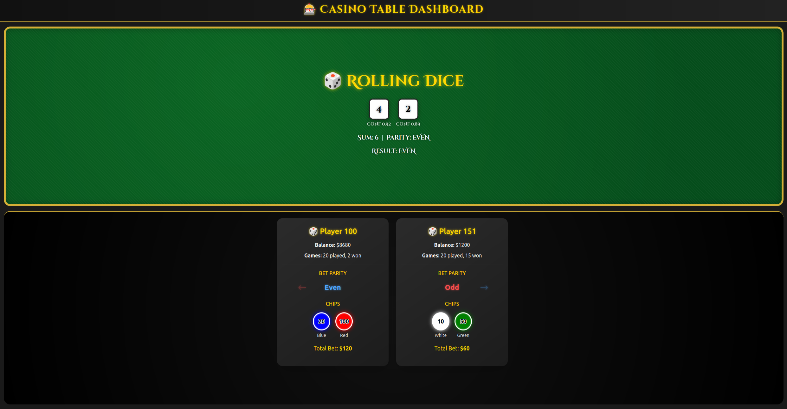
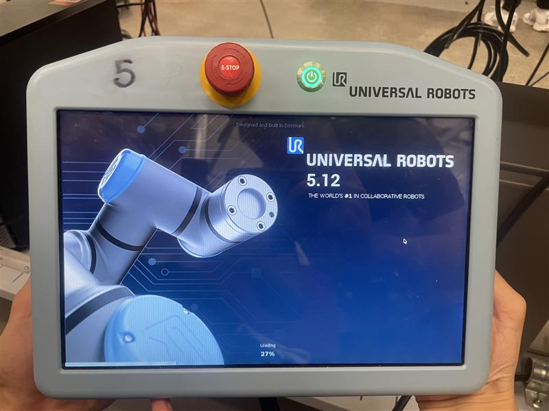
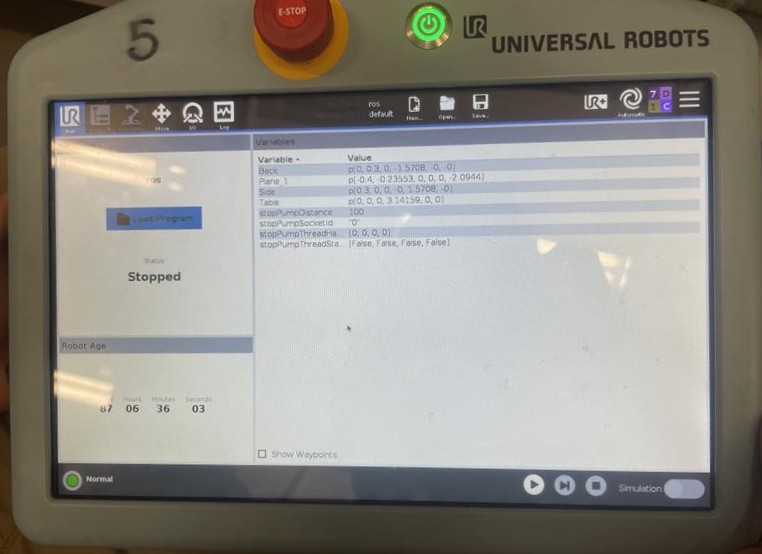
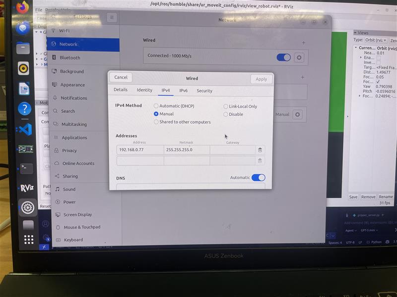
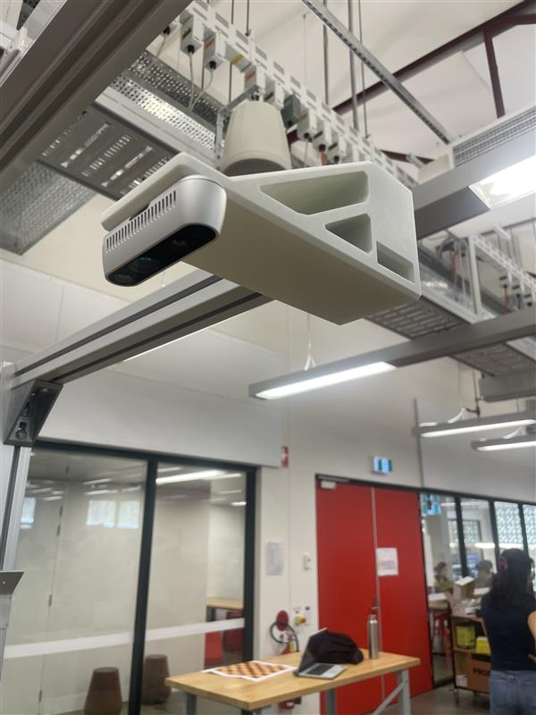
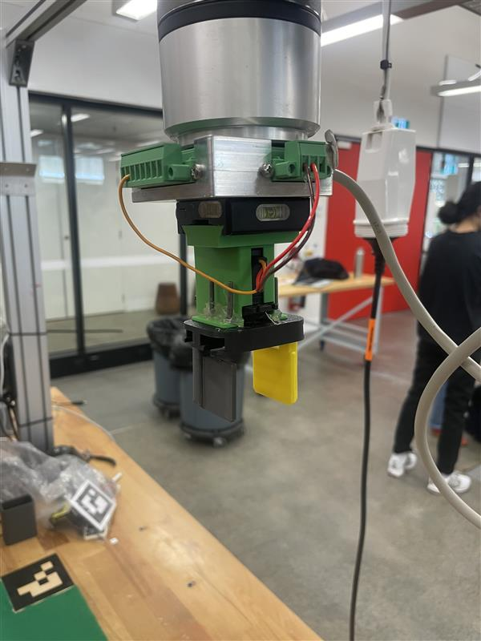
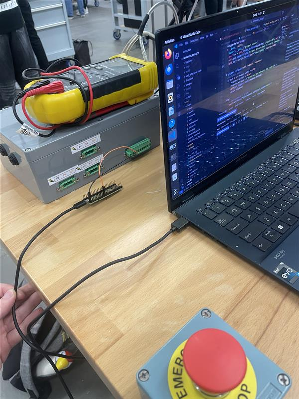

# Dice-Playing Robot Casino (Ur5e)

# 1. Table of Contents

- [2. Project Overview](#2-project-overview)
- [3. System Architecture](#3-system-architecture)
- [4. Technical Components](#4-technical-components)
- [5. Installation and Setup](#5-installation-and-setup)
- [6. Running the System](#6-running-the-system)
- [7. Results and Demonstration](#7-results-and-demonstration)
- [8. Discussion and Future Work](#8-discussion-and-future-work)
- [9. Contributors and Roles](#9-contributors-and-roles)
- [10. Repository Structure](#10-repository-structure)
- [11. References and Acknowledgements](#11-references-and-acknowledgements)

---

# 2. Project Overview

## 2.1 Problem Statement and Customer
Casinos continue to rely on human-operated table games. This results in high operational costs, inconsistent gameplay speed, and increased risk of human error. At the same time, players seek fast, transparent, and beginner-friendly gaming experiences, while casinos demand compact, reliable, and regulation-compliant automated solutions. There is currently a gap in the market for a small-footprint, visually verifiable, automated dice game suitable for high-density casino floors.
   
This project demonstrates the automation of the a game called "Odds & Evens Dice Game" as a proof-of-concept for introducing low-cost, high-turnover robotic casino games.

| Category | Requirement ID | Description |
|----------|----------------|-------------|
| Functional | F1 | Fully automated dice rolling and return to cup |
|  | F2 | Automatic evaluation of bets and payout calculation |
| | F3 | Visual confirmation of physical dice results |
| | F4 | Real-time display of game status, results, and betting windows |
| | F5 | Compatibility with standard casino betting interfaces (e.g. chips) |
| Performance| P1 | Short time from game start to dice roll |
|  | P2 | Low latency vision pipeline |
| | P3 | True randomness |
|| P4 | Transparent operation — dice visible throughout game cycle |
|| P5 | Pick-up accuracy and repeatability |
| User Experience | UX1 | Simple, intuitive gameplay suitable for novice users |
|| UX2 | Clear, readable on-screen instructions and outcomes |
|| UX3 | Visual feedback for game events |
|| UX4 | Accessible interface |


## 2.2 Robot Functionality Summary

At startup the game frontend is launched. The perception pipeline start by identifying the 4 ArUco that mark the corners of the game board. From this, it begins identfying the dice, cup, and player states. The board state should begin as seen below: with the dice in the cup and placed in the designated play area - which is the area covered in green felt - and the player sections should be clear of aruco markers and chips.


The players should now place their ArUco marker ID's in a designated player section. The systems perception will automatically detect the player markers and populate the front end with player information.With our players in, they may being placing bets. Once again the systems perception will automatiaclly detect the bets and populate the front end based on the bets placed on the board. Once bets are placed, our players make their prediction on the dice outcome through the front end. Once all players have made a prediction the start button will become availible. 



After the start button is pressed, the robot will move to a designated 1st position and open the gripper. It will then move to pick up the cup based on the perception pipelines prediction of cup position and orientation. The robot will pick up the dice cup, lift it slightly make a roll and the place the cup back down in it's starting position. The robot will now return back to the designated 1st position. Now the yolo model works to identify the dice outcome which is then reported to the front end, confirming the results of the round and allowing dealers to handle payout. 


The robot now moves to each die, picking it up and placing it back in the cup, before returning to the home position.  

## 2.3 Demo Video
### 2.3.1 Initial Testing video
[](https://drive.google.com/file/d/1irMjWqZdTdLUCx5GPTzw7JCPZO1h40ZF/view?usp=drive_link)

above is a sped up video showing the system performing 1 round of gameplay.  

### 2.3.2 Presentation day Video

[](https://youtu.be/GC9QNMmfosw)


---

# 3. System Architecture

## 3.1 ROS2 Node Graph


The system follows a closed-loop pipeline that connects perception, decision-making and robot execution. The RealSense camera publishes RGB and depth data, which feed into the ArUco, dice, cup and player CV nodes. These perception nodes publish structured messages that the **brain** node uses to manage game logic, evaluate player bets and request robot actions. The brain communicates with the custom MoveIt Cartesian planning server to generate motion trajectories, which are executed by the UR5e controllers. Throughout execution, joint states, collisions and controller feedback flow back into MoveIt and the brain, closing the loop. Finally, all high-level state updates (players, dice results, round outcomes) are forwarded via rosbridge to the web dashboard for visualisation.

## 3.2 Package-Level Architecture


This diagram summarises the high-level interactions between all ROS2 packages in the system.


## 3.3 Behaviour Tree / State Machine


## 3.4 Node Summaries

| Node Name                              | Package              | Role / Description                                                                                                                                                          | Key Topics / Interfaces                                                                                           |
|----------------------------------------|----------------------|----------------------------------------------------------------------------------------------------------------------------------------------------------------------------|-------------------------------------------------------------------------------------------------------------------|
| `brain`                                | `brain`              | Central game controller. Runs the round state machine, coordinates perception, motion planning and gripper actions, and exposes a simple interface to the dashboard.      | Sub: `/dice_results` (DiceResults), `/cup_result` (CupResult), `/players` (Players) <br> Action client: `/moveit_path_plan` (Movement) <br> Service clients: `/gripper_cmd`, `/start_round` |
| `cartesian_move_demo` | `moveit_path_planner` | MoveIt-based motion planning and execution server for the UR5e. Handles both Cartesian and joint goals, applies joint constraints and collision objects, and executes plans. | Action server: `/moveit_path_plan` (custom_interface/Movement) <br> Uses MoveGroupInterface for `ur_manipulator` and PlanningScene collision objects                                      |
| `gripper_server`                       | `gripper`            | Gripper controller. Receives open/close requests and drives the physical end-effector (via microcontroller / IO) with success feedback.                  | Service server: `/gripper_cmd` (GripperCmd)                                                                       |                           |
| `dice_cv`                        | `perception_cv`      | Detects dice in the camera image, classifies their face values, and estimates 3D poses in the board/world frame for use by the brain and MoveIt planner.                  | Sub: `/camera/color/image_raw` <br> Pub: `/dice_results` (DiceResults) <br> Optional RViz markers (e.g. `/dice_markers`) |
| `cup_cv`                         | `perception_cv`      | Segments the cup using colour / HSV masks and blob geometry, estimates its centroid and orientation, and publishes a stable pose for grasping and placement.             | Sub: `/camera/color/image_raw` <br> Pub: `/cup_result` (CupResult) <br> Optional RViz markers                          |
| `aruco_cv`                       | `perception_cv`      | Detects ArUco markers on the game board, estimates the board pose, and maintains the board frame used for pixel-to-board and board-to-world transforms.                  | Sub: `/camera/color/image_raw` <br> Pub: board pose / calibration topic (e.g. `/board_pose`) <br> Broadcasts TF `world → board` |
| `player_cv`                      | `perception_cv`      | Identifies player ids using aruco detection, and chip locations using colour masking. Constructs and publishes a structured list of players and bets to the brain and dashboard.  | Sub: `/camera/color/image_raw` <br> Pub: `/players` (Players)                                                       |
| `rosbridge_websocket`                  | `rosbridge_server`   | Bridges ROS2 topics, services and actions to the web dashboard, enabling live game state, dice results and round status to be shown in the browser UI.                   | WebSocket server for dashboard <br> Forwards topics such as `/dice_results`, `/cup_result`, `/players`, game status  |


## 3.5 Custom Messages and Interfaces

---

### 3.5.1 Custom Messages

<details>
<summary><strong>Message Definitions</strong> (click to expand)</summary>

#### `DiceResult.msg`

| Field | Type | Description |
|-------|--------|-------------|
| `x, y, width, height` | `int32` | 2D pixel bounding box of the die |
| `dice_number` | `int32` | Detected die face value (1–6) |
| `confidence` | `float32` | YOLO detection confidence |
| `pose` | `geometry_msgs/Pose` | Die pose in the world frame |

**Usage:** Published by `dice_cv`; consumed by `brain` to compute outcomes and generate pick poses.

---

#### `DiceResults.msg`

| Field | Type | Description |
|-------|--------|-------------|
| `dice` | `DiceResult[]` | All detected dice in a frame or round |

**Usage:** Published on `/dice_results`; consumed by `brain` and the dashboard.

---

#### `CupResult.msg`

| Field | Type | Description |
|-------|--------|-------------|
| `x, y, width, height` | `int32` | Cup bounding box in warped board frame |
| `confidence` | `float32` | Detection confidence |
| `pose` | `geometry_msgs/Pose` | Cup pose in the world frame |
| `drop_pose` | `geometry_msgs/Pose` | Predefined cup drop location |

**Usage:** Published by `cup_cv`; consumed by `brain` and passed to MoveIt.

---

#### `Player.msg`

| Field | Type | Description |
|-------|--------|-------------|
| `player_id` | `string` | Logical identifier (ArUco ID) |
| `position` | `int32` | Table position (1–3) |
| `bet_is_odd` | `bool` | `true` = odd, `false` = even |
| `bet_colors` | `string[]` | Chip colours |
| `bet_x`, `bet_y` | `int32[]` | Chip centroids (pixels) |
| `bet_diameter_px` | `int32[]` | Chip diameters (pixels) |

**Usage:** Published by `player_cv` and used by `brain` and UI.

---

#### `Players.msg`

| Field | Type | Description |
|-------|--------|-------------|
| `players` | `Player[]` | List of detected players and their bets |

**Usage:** Shared between `player_cv`, `brain`, and UI.

---

#### `RoundResult.msg`

| Field | Type | Description |
|-------|--------|-------------|
| `is_odd` | `bool` | Whether round result is odd |
| `is_complete` | `bool` | Whether round has finished |
| `dice_results` | `DiceResults` | Final dice state |

**Usage:** Published at end of round for UI updates and payout calculation.

</details>

---

### 3.5.2 Custom Actions

<details>
<summary><strong>Action Definitions</strong> (click to expand)</summary>

#### `Movement.action`

| Section | Fields / Meaning |
|---------|------------------|
| **Goal** | `string command`, `float64[] positions`, `string constraints_identifier` |
| **Result** | `bool success` |
| **Feedback** | `string status` |

**Usage:** Interface between `brain` and `moveit_path_planner` for UR5e movements.

</details>

---

### 3.5.3 Custom Services

<details>
<summary><strong>Service Definitions</strong> (click to expand)</summary>

#### `StartRound.srv`

| Component | Fields |
|-----------|--------|
| **Request** | `bool start` |
| **Response** | `bool accepted`, `string message` |

**Usage:** Dashboard → `brain` round trigger.

---

#### `GripperCmd.srv`

| Component | Fields |
|-----------|--------|
| **Request** | `int32 width` |
| **Response** | `bool success`, `string message` |

**Usage:** Low-level gripper command from `brain` to `gripper`.

---

#### `ResetGripperCmd.srv`

| Component | Fields |
|-----------|--------|
| **Request** | `bool reset_gripper` |
| **Response** | `bool success`, `string message` |

**Usage:** Re-home the gripper on startup or recovery.

</details>

---

# 4. Technical Components

<p align="center">
  
  
  
  
</p>


## 4.1 Computer Vision Pipeline

The perception stack is split into separate ROS2 nodes for board localisation, cup detection, dice detection and player / chip detection. Each node subscribes to a colour camera stream and publishes geometric information (poses, chip locations, bets) that the `brain` node uses to drive the game.

### 4.1.1 ArUco Board Detection (`aruco_cv`)

<details>
<summary><strong>ArUco Board Detection Implementation</strong> (click to expand)</summary>


The ArUco node establishes the **`board_frame`**, which is the common reference for every other CV module and for motion planning. All dice, cup and player coordinates are ultimately expressed relative to this frame.

---

#### Purpose in the system

- Detect the four ArUco markers attached to the corners of the physical board.
- Estimate the board’s pose relative to the camera and world.
- Produce the **rectified, top-down board image** used by all other vision pipelines.
- Publish simple RViz markers so the board alignment can be checked easily.

---

#### Inputs & Setup

- **RGB image** from the depth camera  
  (`/camera/camera/color/image_raw`, configurable via `color_topic`)
- **Camera intrinsics** from `/camera/camera/aligned_depth_to_color/camera_info`
- **Processing throttle**: the node only processes every **4th frame** to keep CPU usage low.

The TF tree produced is:

```
world
└── camera_frame
    └── board_frame
```

---

#### Raw Camera View


---

#### Detecting the board corners

Each frame:

1. The image is converted to BGR via `CvBridge`.
2. The node runs ArUco detection using the `DICT_4X4_250` family.
3. It extracts the centroids of markers **0, 1, 2, 3**, representing TL, TR, BR, BL.
4. If fewer than 4 markers are visible, the frame is skipped. The last valid pose is retained.

---

#### Estimating the board pose

Using the four detected centroids:

- Compute the **board centre** in pixel space.
- Using camera intrinsics and a fixed height, back-project to metric `(x, y)`.
- Estimate the **board yaw** from the average direction of its edges, yielding a smooth and stable orientation estimate.

The transform is published as:

- Parent: **`camera_frame`**  
- Child: **`board_frame`**

with translation `(x, y, CAM_HEIGHT_M)` and yaw-derived rotation.

---

#### Warped top‑down board image

The node computes a homography using the board corners, mapping them to a target space matching the physical board size:

- Destination dimensions: **`BOARD_W_MM × BOARD_H_MM`**
- Result: **1 pixel = 1 mm** in the warped image

Published on:

- **`board/warped_image`**

---

#### Warped Board View


---

#### RViz markers

Corner points are transformed into the warped image and then into metric board coordinates.  
For each (`TL`, `TR`, `BR`, `BL`), the node publishes:

- A cube marker in `board_frame`
- A text label above the cube

This visualisation confirms stable detection and consistent alignment.

---

#### Downstream use

Other CV modules rely on the board frame:

- **dice_cv** — converts dice detections into world-frame picking poses
- **cup_cv** — locates the cup base and orientation
- **player_cv** — assigns chips to the correct betting zones

If detection fails, the transform is not updated, preventing jumps in downstream components.

</details>

---

### 4.1.2 Dice Detection (`dice_cv`)

<details>
<summary><strong>Dice Detection Implementation</strong> (click to expand)</summary>

The dice detection pipeline operates on the **rectified, top‑down board image** produced by the ArUco node. Its job is to detect dice reliably, estimate their orientation, and output usable 3D poses for the robot.

---


#### Purpose in the system

- Detect all dice visible on the board.
- Classify each die’s face value (1–6).
- Estimate the die’s in‑plane rotation (yaw).
- Convert pixel positions into **board-frame** and **world-frame** coordinates.
- Publish structured detections and visual markers used by the robot and UI.

---


#### Inputs and outputs

##### **Subscribed**
- `board/warped_image` (Image) — top‑down view of the board.

##### **Published**
- `dice_results` (DiceResults) — world-frame poses of dice.
- `dice_markers` (MarkerArray) — board-frame RViz cubes and labels.
- `dice_ee_goal_markers` (MarkerArray) — end-effector goal visualisations.

##### **Model**
- Loads a custom YOLO model (`best.pt`) from `perception_cv/dice_cv/weights`.

##### **TF**
Uses the existing TF chain:

```
world
└── camera_frame
    └── board_frame
```

---

#### Annotated Dice Detections

The warped-board view includes:

- Rotated bounding boxes  
- Dice value + confidence  
- Orientation arrow  
- Crop region rectangle  


---

#### Processing overview

##### 1. **Pre‑processing and crop**
- Incoming warped image is converted via `CvBridge`.
- A rectangular crop is taken from the **upper half** of the board where dice land.
- YOLO inference runs only on this crop (faster, fewer false positives).
- The crop region is drawn in green on the final debug image.


##### 2. **YOLO inference**
Each YOLO detection produces a bounding box, class index, and confidence.

- Detections below **0.55 confidence** are ignored.
- The node keeps track of:
  - `dice_count`
  - `total_sum` (sum of all detected die values)
- These are drawn in the debug overlay.

---

#### Rotation estimation (simple contour method)

For each YOLO bounding box:

1. Extract the die region from the full warped image.  
2. Convert to grayscale, apply Otsu thresholding.  
3. Find external contours; select the largest.  
4. Fit a `minAreaRect` to determine the die’s rotation angle.  
5. Convert OpenCV’s clockwise angle into a usable yaw.

If anything fails (no contour, noisy threshold), yaw defaults to **0°**, and the frame continues safely.

A rotated bounding box is redrawn around the die for clarity.

---

#### Converting pixels → board and world

##### **Board-frame coordinates**
```
pixel_to_board_coords(
    x_px = centre_x,
    y_px = centre_y,
    img_w, img_h,
    z_offset = DICE_HALF_HEIGHT (0.03m)
)
```

Returns `(x_m, y_m, z_m)` in **metres** inside the `board_frame`.

##### **World-frame pose**
```
pixel_to_world_pose(..., yaw_rad, tf_buffer)
```

- Uses camera intrinsics + `world → camera_frame` TF.  
- Outputs a full `PoseStamped` in the `world` frame.  
- If TF lookup fails, that dice detection is skipped.

##### **Yaw correction for MoveIt**
The robot’s tool convention requires a 180° flip around the Y-axis:

```
pose.orientation = orientation ⨉ quaternion_from_euler(0, π, 0)
```

This ensures the die is approached correctly.

---

#### Publishing results

##### **World-frame**
The node fills a `DiceResult` message for each detection:

- Pixel bbox  
- `dice_number`, `confidence`  
- Corrected world-frame pose  

All `DiceResult`s are packed into a `DiceResults` message and published.

---

#### Board-frame visualisation

For each detection, a simplified board-frame version is created:

- Position: `(x_m, y_m, z_m)`
- Orientation: yaw-only quaternion
- Passed to `publish_dice_markers()`

This function:

- Clears old markers using `DELETEALL`
- Publishes:
  - A **red cube** at the dice location
  - A **white text label** showing the dice value just above it

These markers provide intuitive feedback in RViz.

---

#### End-effector goal markers

A world-frame `PoseStamped` is created for each die.  
`visualise_pose_in_rviz()` publishes small axis markers to show where the robot will approach from.

These markers appear on the topic:

- `dice_ee_goal_markers`

---

#### Debug view and GUI

The node maintains an OpenCV window `"Dice Recognition"`.

Overlays include:

- Crop region  
- Rotated bounding boxes  
- Dice number + confidence  
- Dice count & total sum  

A small timer ensures the GUI stays responsive even when no new frames arrive.

This makes it easy to verify that:

- YOLO detects only the intended dice region  
- Rotations look stable  
- World-frame poses are reasonable before being passed to the `brain`

</details>

---

### 4.1.3 Cup Detection (`cup_cv`)
<details>
<summary><strong>Cup Detection Implementation</strong> (click to expand)</summary>

The cup detection pipeline works on the same rectified board image as the dice node and produces a single, stable pick pose for the cup. It combines a simple colour mask with geometry-based reasoning to estimate both the base position of the cup and the direction the gripper should approach from.

---

#### Role in the system

- Find the yellow cup on the warped board image.
- Estimate the pose of the cup base in both the `board_frame` and `world` frames.
- Infer a consistent pickup direction for the UR5e gripper.
- Publish a `CupResult` message that the `brain` and motion planner can use directly.

---

#### Inputs and outputs

- **Subscribed topics**
  - `Image` on **`board/warped_image`** – the top-down board view produced by the ArUco node.
- **Publishers**
  - `CupResult` on **`cup_result`** – world-frame pose and bounding box of the cup.
  - `MarkerArray` on **`cup_markers`** – board-frame 3D box for RViz.
  - `MarkerArray` on **`cup_ee_goal_markers`** – end-effector target pose for the gripper.
- **TF**
  - Uses a `tf2_ros.Buffer` and `TransformListener` to access the `world → camera_frame → board_frame` transforms.

---

#### Colour mask and cropping

To make detection simple and robust, the node only looks at the region of the board where the cup is expected to appear and applies a yellow colour mask.

- The incoming warped board image is cropped to the upper central region:
  - A horizontal padding of about 110 px on each side.
  - Only the top half of the warped board (similar to the dice node).
- The cropped region is converted to HSV and thresholded using a fixed yellow range.
- A small morphological open/close operation removes isolated noise and fills gaps.
- The resulting binary mask is shown in a separate debug window for tuning.

**Cup colour mask**:


---

#### Selecting the cup blob

- All external contours in the mask are extracted.
- The node keeps only the largest contour above a minimum area threshold (`MIN_CONTOUR_AREA`) so that small specks of noise are ignored.
- If no valid contour is found:
  - An empty `CupResult` is published.
  - The current frame is shown for debugging and the callback returns early.

Once a valid contour is found, it is treated as the visible footprint of the cup in the cropped image.

---

#### Orientation and base footprint

Rather than relying only on the raw contour, the node enforces a known footprint for the cup:

- A rotated bounding box (`cv2.minAreaRect`) is fitted to the contour.
- Among the rectangle’s edges, the node chooses the long edges and biases towards those that are more vertical in the image. This stabilises the orientation when the box becomes nearly square.
- Using this long edge and a known physical footprint (approximately 10×4 cm), the node reconstructs a clean base rectangle that:
  - Shares the leftmost long edge of the fitted box.
  - Extends inward across the board by the known width of the cup base.

The centroid of this reconstructed base rectangle is used as the cup base position in the cropped image.

---

#### Visual annotations on the warped board

For each frame, the node draws several overlays on the full warped board image:

- **Green box** – the original rotated bounding box around the detected yellow blob.
- **Yellow box** – the reconstructed base rectangle that enforces the correct cup footprint.
- **Red dot** – the centroid of the reconstructed base, interpreted as the cup base.
- **Blue arrow** – the approach direction for the gripper, derived from the estimated yaw.

All of these are drawn in full-image coordinates (after accounting for the crop offset), giving an intuitive view of what the node thinks the cup pose and pickup direction are.

**Cup detection on warped board**:


---

#### Converting to board and world poses

Once the base centroid has been found in full-image pixel coordinates:

- The node calls `pixel_to_board_coords(...)` with a small height offset (`CUP_HALF_HEIGHT = 0.06` m) to obtain `(x, y, z)` in the `board_frame`.
- It also calls `pixel_to_world_pose(...)` with the same pixel centre, height offset and yaw angle to obtain a `PoseStamped` in the `world` frame.
- If TF lookup fails, the node logs a warning and skips publishing a cup pose for that frame.

---

#### Publishing `CupResult`

The main world-frame output is a `CupResult` message:

- 2D bounding box fields (`x`, `y`, `width`, `height`) describe the cup in full warped-image pixels.
- `confidence` is set to 1.0 (the node assumes exactly one cup is present once a valid blob is found).
- `pose` holds the final world-frame pose that the UR5e end-effector should move to above the cup.
- `drop_pose` is initially copied from the same world pose and can be used as a starting point for where the cup will be placed.

Before publishing, the node adjusts this pose to better match the end-effector frame and tool geometry:

- A local offset of about 14 cm along the cup’s local X-axis is applied so that the wrist target sits behind the cup rather than at its centre.
- An additional fixed rotation is applied to align the gripper with the cup axis using a pre-defined Euler rotation (`π/2, π, π/2`).

These adjustments mean that downstream components (the `brain` and motion planner) can treat `cup_result.pose` as a ready-to-use end-effector goal.

---

#### Board-frame markers and RViz view

For visualisation in `board_frame`:

- The node builds a simplified `CupResult` with:
  - Position `(x_m, y_m, z_m)` in `board_frame`.
  - Orientation constructed from the estimated yaw.
- It publishes a `MarkerArray` on `cup_markers` that contains:
  - A yellow 3D box that roughly matches the cup dimensions (10×4×8 cm) and is positioned so that the base sits on the board surface.

To visualise the end-effector goal, the node also:

- Wraps the world pose in a `PoseStamped` with `frame_id = "world"`.
- Calls `visualise_pose_in_rviz(...)` with `cup_ee_goal_markers` as the publisher, drawing an axes marker at the intended approach pose above the cup.

---

#### Debugging and GUI

- An OpenCV window named `Cup Detection` shows the main warped-board view with all annotations (bounding boxes, centroid, and approach arrow).
- A separate window (`Cup Mask`) shows the current yellow mask, which is useful for tuning the HSV thresholds.
- A small timer (`gui_timer`) keeps the GUI responsive by regularly calling `cv2.waitKey(1)` even when new images are not arriving.

Together, the colour mask, geometric reconstruction and RViz markers make it easy to see how the system is interpreting the cup’s position and orientation before the UR5e commits to a pick-up motion.

</details>

---

### 4.1.4 Player and Bet Detection (`player_node`)
<details>
<summary><strong>Player and Bet Detection Implementation</strong> (click to expand)</summary>

The player detection pipeline is responsible for mapping physical players and their chips on the board to a structured `Players` message that the `brain` and dashboard can use. It runs on the warped board image, reuses the same coordinate system and divides the table into three logical zones, one per player.

---

#### Role in the system

- Detect which player positions (1–3) are currently active using ArUco markers.
- Segment and classify coloured chips in the betting area.
- Assign chips to players based on their horizontal zone.
- Publish a `Players` message containing chip locations, colours and diameters for each player.
- Provide simple RViz markers so player positions can be checked at a glance.

---

#### Inputs and outputs

- **Subscribed topics**
  - `Image` on **`board/warped_image`** – top-down board view produced by the ArUco node.
- **Publishers**
  - `Players` on **`players`** – list of players and their detected chips/bets.
  - `MarkerArray` on **`player_markers`** – cube + text markers in `board_frame` for each player.

---

#### Annotated player view

The main debug view shows:
- The ArUco marker bounding boxes and player labels (`P1`, `P2`, `P3`).
- Blue rectangular “zones” corresponding to each player’s betting area.
- Circles around detected chips, coloured by chip colour and annotated with size and zone.

This is captured in a warped-board image like:


---

#### Cropping and player zones

Players and chips are only expected in the lower half of the warped board image. To simplify processing and avoid interference with dice and cup graphics:

- The node crops the **bottom half** of the warped image, with a horizontal padding of about 100 px on each side.
- This cropped region defines the “player area” where ArUco tags and chips are searched for.
- The horizontal span of the player area is split evenly into **three zones** (left, middle, right). Each zone corresponds to one logical player position:
  - Zone 1 → Player position 1 (left)
  - Zone 2 → Player position 2 (centre)
  - Zone 3 → Player position 3 (right)

On the debug image, the overall player area is outlined, and each zone is shown as a separate rectangle with a `Zone 1/2/3` label at the top.

---

#### Player detection with ArUco markers

Players are identified using ArUco markers placed near each player’s seat:

- The node runs ArUco detection (`DICT_4X4_250`) on the cropped player region.
- For each detected marker:
  - The marker centre is converted back into full-image coordinates using the crop offsets.
  - The x-position is compared to the pre-defined zone bounds to determine which of the three positions (1–3) this marker belongs to.
  - The marker centre is converted to metric board coordinates using `pixel_to_board_coords(...)`.
  - A `Player` message is created with:
    - `player_id` set to the numeric ArUco ID.
    - `position` set to 1, 2 or 3 based on the zone.
    - Empty arrays for chip information (`bet_colors`, `bet_x`, `bet_y`, `bet_diameter_px`) that will be filled later.
- Simple RViz markers are created for each player:
  - A small green cube at the player’s board-frame position.
  - A text label above the cube, e.g. “Player 23”.

On the debug image, each marker location is annotated with a label `P{position}`, so you can see at a glance which real-world marker is mapped to which logical seat.

---

#### Chip detection and assignment to players

After players are located, the node looks for circular chips within the same player area:

- The cropped region is converted to HSV colour space.
- For each colour class (blue, green, red, white), a dedicated HSV range is applied to create a mask.
- A small morphological close and median blur clean up the mask.
- Contours are detected in each mask, and only those that look like valid chips are kept, using:
  - Approximate diameter limits (between `LOWER_LIMIT` and `UPPER_LIMIT` pixels).
  - An area check consistent with that diameter.
  - A solidity check to reject irregular or fragmented blobs.
- For each accepted contour:
  - The centre `(cx, cy)` and diameter are computed from the minimum enclosing circle.
  - The global image coordinates are reconstructed using the crop offsets.
  - The x-position is used to determine which zone (1–3) the chip belongs to.

Chips are then assigned to players:

- For each chip, the node finds the `Player` whose `position` matches the chip’s zone.
- The chip’s properties are appended to that player’s arrays:
  - `bet_colors` (e.g. `"blue"`, `"red"`, `"green"`, `"white"`)
  - `bet_x`, `bet_y` (pixel centroids in the warped image)
  - `bet_diameter_px` (measured chip size in pixels)

On the debug image, each chip is drawn as a coloured circle with a short label containing its colour, approximate diameter and zone (e.g. `blue (36px) Z2`).

---

#### Published messages and markers

At the end of each frame:

- A `Players` message containing all active `Player` entries is published on `/players`. This exposes, for each logical seat:
  - The ArUco-derived `player_id` and table position.
  - A list of chip colours and pixel locations that the `brain` and dashboard can interpret as bets.
- A `MarkerArray` with cubes and text labels for each player is published on `/player_markers`, rendered in the `board_frame` for RViz.

These outputs give the rest of the system a clean, geometry-aware view of “who is sitting where” and “which chips are in front of which player”, without needing to re-run any image processing.

---

#### Debugging and GUI

- An OpenCV window named `Player Detection` shows the warped board with:
  - The player region outline.
  - The three zone rectangles.
  - ArUco-based player positions (`P1`, `P2`, `P3`).
  - Coloured chip overlays.
- A small timer (`gui_timer`) keeps the window responsive by calling `cv2.waitKey(1)` periodically, even if new images are not arriving.

This view makes it easy to verify that:
- Players are being assigned to the correct seat positions.
- Chips fall inside the expected zones.
- The mapping from physical layout → warped image → board frame is behaving as intended before the `brain` uses these detections to drive game logic.

</details>

---

## 4.2 Custom End-Effector

The end effector is a linear gripper designed to reliably manipulate both the dice and the cup. The gripper is actuated using a rack-and-pinion mechanism, with a central pinion gear driving two opposing, gear-profiled gripper fingers that function as linear racks. This configuration ensures symmetric finger motion and consistent gripping force.

<div style="display: flex; justify-content: center; gap: 20px; align-items: center;">
  <div style="text-align: center;">
    
    <p><em>Render of Fully Assembled Gripper</em></p>
  </div>

  <div style="text-align: center;">
    
    <p><em>Render of Exploded Gripper Assembly</em></p>
  </div>
</div>


A key advantage of the linear gripper design is its passive self-centring behaviour. As long as the object lies between the open fingers, the closing motion naturally guides it toward the centre of the gripper. This makes the system highly tolerant to positional misalignment between the gripper and the object, improving robustness, repeatability, and overall reliability during operation.

Actuation is controlled using a **Teensy 4.1 microcontroller**, which drives a **DSS-PO5 Standard Servo** to position the gripper with precise and repeatable motion. 

The Brain node commands the gripper via a dedicated gripper server using a service-based interface. Each service call specifies the desired target position for the servo motor.

Upon receiving a request, the gripper server transmits the position command to the Teensy 4.1 microcontroller over a serial connection. The Teensy then generates the appropriate PWM signal to drive the servo to the requested position. Once actuated, the servo provides sufficient holding torque to securely grasp and lift both the dice and the cup during operation.

The STL files for the gripper can be found in the repository.  

## 4.3 System Visualisation

This section describes how the system is visualised through RViz and the web-based dashboard.

### 4.3.1 RViz Visualisation

RViz provides a robotics-focused view of the system, including TF frames, 3D object detections, and robot trajectories.


---
#### RViz Configuration Table

| Visual Element | Source Node / Topic | Description | Notes |
|----------------|----------------------|-------------|--------|
| TF Frames (world, camera_frame, board_frame) | Published in perception_cv | Shows the coordinate system used for perception and planning. | Standard RViz TF display. |
| Blue ArUco Markers | aruco_cv → /aruco_markers | Corner markers defining the board frame. | Verifies correct board alignment. |
| Red Dice Markers | dice_cv → /dice_markers | Dice positions with numerical labels. | Confirms pixel-to-board mapping. |
| Dice EE Goals | dice_cv → /dice_ee_goal_markers | End-effector pickup poses for each die. | Ensures correct grasp orientation. |
| Yellow Cup Marker | cup_cv → /cup_markers | 3D cup bounding box in board_frame. | Used for pickup alignment. |
| Cup EE Goal | cup_cv → /cup_ee_goal_markers | Approach pose for the cup. | Guides UR5e for grasping. |
| Green Player Markers | player_cv → /player_markers | Shows detected player positions and IDs. | Validates zone mapping and detection. |
| UR5e Robot Model | MoveIt RViz plugin | Displays real-time robot state (gray), target state (orange), and planned trajectory (purple). | Standard MoveIt functionality. |
| Planned Path | MoveIt → /move_group/display_planned_path | Visual path preview for trajectory execution. | Confirms reachability & collision-free paths. |

*For more infomation about how the marker messages are constructed and published, see section 4.1.*

---

#### Visualising End Effector (URDF)
> TODO: Describe how to end effector is visualised in rviz. Include images and gifs of the joints moving. Brief overview on how it was done


---

### 4.3.2 Web Dashboard Visualisation

The Casino Table Dashboard is a React front end that connects to ROS2 through `rosbridge_server`. It gives operators a clean view of players, bets, dice results and round status without opening RViz or any ROS tools.

---

#### ROS connection

The dashboard uses `roslibjs` and a persistent WebSocket connection:

```js
const ros = new ROSLIB.Ros({ url: 'ws://localhost:9090' });
```

A small helper `getRos()` creates this connection once and reuses it for all topics and services. This keeps the UI responsive and avoids reconnections.

The main ROS interfaces are:

| Purpose            | ROS interface                            | Front end hook                    |
|--------------------|------------------------------------------|-----------------------------------|
| Player detection   | Topic `/players` (`custom_interface/Players`) | `subscribeToPlayers(callback)`    |
| Round outcome      | Topic `/round_result` (`custom_interface/RoundResult`) | `subscribeToRoundResult(callback)` |
| Start new round    | Service `/start_round` (`custom_interface/StartRound`) | `callStartRoundService(callback)` |

Each subscribe helper returns an unsubscribe function so components can clean up when unmounted.

---

#### Play screen: waiting for bets

When no round is running, the dashboard shows the **play screen**:


Layout:

- A large playboard which shows the current game state and prompts players to place bets. When bets are placed, the button changes to showing `Start Game`, allowing for the main closed loop operation to begin.  
- A row of player cards underneath, one per detected player from `/players`. Data for the player cards is fetched from the backend using the `player_id`.

Each player card displays:

- Player ID and seat position (for example `Player 100`, `Position: 1`), from the `/players` topic.  
- Balance and simple game statistics, fetched from the backend.  
- Current bet parity state (initially “No Bet”), which is toggled in the UI.  
- Detected chip stack, colour coded and summarised as a **Total Bet** at the bottom of the card.

The chip colours and values are derived from the `Player` message fields (`bet_colors`, `bet_x`, `bet_y`, `bet_diameter_px`), which are published by `player_cv`. As `/players` updates, the dashboard live updates the chips and totals without a page reload.

When the players press the start button, the front end calls `callStartRoundService`, which sends a `StartRound` request to the `brain` node. The response is logged and used to move the UI from “waiting” into an active round state.

---

#### Result screen: dice rolled

After the robot has rolled and the vision stack has detected the dice, the `brain` node publishes a `RoundResult` message on `/round_result`. The dashboard listens via `subscribeToRoundResult` and switches the board UI to a **results view**:



In this state the dashboard:

- Shows the rolled dice and their values in the header area, along with the confidence values for debugging.
- Highlights whether the outcome was **odd** or **even**, based on `RoundResult.is_odd`.  
- Can indicates winners and losers per player card by comparing each player’s `bet_is_odd` against the round outcome.  

Once `RoundResult.is_complete` is true and the robot has finished resetting, the UI transitions back to the **play screen**, ready for the next round. The flow is therefore:

1. `/players` stable and bets visible.  
2. Operator calls `/start_round` from the dashboard.  
3. Robot rolls dice and `round_result` arrives.  
4. Result view is shown until the system is ready, then the UI returns to the betting state.

This loop matches the physical behaviour of the system and gives a clear, casino-style interface for players.


## 4.4 Closed-Loop Operation


In this project, the robot operates within a closed-loop perception–action framework. The environment is continuously monitored by the vision system, which detects and updates the poses of the board, cup, and dice. These real-time measurements are fed into the Brain node, where they influence decision-making and motion planning. The Brain then sends updated commands to the robot based on the latest available information, and the robot’s actions subsequently alter the environment, completing the feedback cycle. This loop repeats continuously, allowing the system to adapt its behaviour in response to changing conditions.

During normal operation, old pose estimates are constantly overwritten with fresh detections, ensuring that the robot always works with the most accurate state of the world. However, once the robot commits to a deterministic action—such as approaching and picking up a dice—the pose updates for that object are temporarily frozen. This prevents noisy or jittery mid-motion corrections that could destabilise the trajectory. The result is a semi–closed-loop hybrid control strategy: real-time feedback governs high-level decisions and target selection, while carefully controlled open-loop execution ensures precise and stable manipulation.


The dice-handling phase begins with the vision system detecting all dice on the board, determining how many are present, and identifying their face values. During this stage, the dice poses are continuously updated as part of the closed-loop perception system. Once the detections stabilise, the Brain node evaluates the number of dice; if fewer than two are found, the round terminates and the winners are calculated. Otherwise, the dice locations are published to the Brain, which initiates the robot’s motion planning. When a target dice is selected, its pose is temporarily frozen to prevent mid-motion drift, and the robot computes a Cartesian trajectory toward it. The robot then performs a precise grip and pickup, lifts the dice, and moves to a position above the cup. After releasing the dice into the cup, the robot returns to its home position, allowing the camera to reacquire an unobstructed view of the workspace. This cycle repeats while dice remain on the board, with the Brain performing a second detection pass and continuously checking updated pose information between each pickup. Once all dice have been collected, the loop ends and the round is considered complete.

<!-- Discuss:

- What sensor feedback is used (vision, robot state, error signals).
- How stale or inconsistent data is handled.
- Examples of adaptive behaviour (e.g. re-detect dice if occluded, replan if path fails).
- Timing considerations (latency, update rates, synchronisation).

--- -->

# 5. Installation and Setup

## 5.1 Requirements

The system has a number of requirements which must first be met before setup can begin. 

### Ros2
Fistly, the system relies on Ros2 Humble Hawksbill. [HERE](https://docs.ros.org/en/humble/Installation/Ubuntu-Install-Debs.html) is the guide for installing Ros2 Huble Hawksbill via ubuntu debain packages.

### Moveit
All path planning and executing with the Ur5e is done via Moveit. An installation guide can be found [HERE](https://moveit.ai/install-moveit2/source/).

### RealSense
To make use of the RealSense camera we require the appropriate ros wrapper. Follow the installation guide at in the ReadMe [HERE](https://github.com/realsenseai/realsense-ros?tab=readme-ov-file#installation-on-ubuntu).

### NodeJS and NPM
The front-end requires NodeJS to operate and npm to handle dependencies. Installing NodeJS should install npm with it. On Debian-based systems, you can use the NodeSource repository or Node Version Manager (NVM). For the NodeSource method, first update your system and install dependencies:
```bash
sudo apt update && sudo apt upgrade -y
sudo apt install -y curl
```
Then, use the setup script for Node.js 18:
```bash
curl -fsSL https://deb.nodesource.com/setup_18.x | sudo -E bash -
sudo apt install -y nodejs
```
### Front-End
**TO BE DONE AFTER CLONING INTO REPO**

To ensure all front end dependencies are installed, run the follwing commands from the base of the repository. 
```bash
cd frontend
npm install
```

### Additional Back-End
The back end requires a couple more packages. These include some extra drivers as well as python libraries for the vision and and end-effector code. 
```bash
pip install -r requirements.txt

sudo apt install ros-humble-rosbridge-server

sudo apt install ros-humble-message-filters

sudo apt install ros-humble-tf-transformations
```

## 5.2 Workspace Setup and Cloning the Repo
Navigate to your desired workspace directory and clone the repository:

```bash
git clone https://github.com/LachlanWallbridge/casino_ur5_project.git
cd casino_ur5_project

colcon build --symlink-install
source install/setup.bash
```

## 5.3 Hardware Setup

### UR5e Startup
Follow these steps to safely power on and initialise the UR5e robot using the teach pendant.

1. Turn on the **main power switch** located on the UR5e control box.
2. The **teach pendant will boot automatically** and display the UR interface.

<p align="center">
  
</p>

3. Ensure the **Emergency Stop (E-Stop)** button on the teach pendant and the control box
   are both **released** (twist clockwise to release if engaged). If either E-Stop is pressed, the robot will not power on.
5. On the teach pendant, the startup screen will show the robot as **Powered Off**.
6. Press the **Power On** button.
7. Wait for the system to initialise.
8. Once powered, press **Unlock** on the teach pendant.
9. The robot joints will now be enabled but not yet moving.
<p align="center">
  
</p>
10. Navigate to the **Program** tab.
11. Select and load the `ros.urdf` program.

<br>

**Safety Notes**
- Always ensure the **workspace is clear** before enabling motion.
- Never stand within the robot’s **maximum reach at startup**.
- Keep one hand near the **E-Stop** during initial testing.

---


### UR5e Connection

1. Connect the **UR5e Ethernet cable (orange)** to your computer.
2. Open **Wired Network Settings → IPv4**.
3. Change **IPv4 Method** to **Manual**.
4. Enter the following values:
   - Address: `192.168.0.77`
   - Netmask: `255.255.255.0`
5. Click **Apply**.

<p align="center">
  
</p>

---

### Camera Setup

1. Mount the RealSense camera onto its bracket using a screwdriver, with the **USB connector facing toward the robot**.
2. Slide the camera mount onto the top brace of the frame.
3. Plug the RealSense USB cable into a **USB 3.1 port** on the computer.

<p align="center">
  
</p>

---

### End-Effector Installation

1. Remove the **tripod adapter** from the UR5e wrist.
2. Slide the custom end-effector into the mount, ensuring the **motor cables face the connector ports**.
3. Connect the end-effector wiring:
   - Power → UR5e auxiliary power
   - Motor signal → **Analog Input Slot 2**
4. Open the Teensy serial monitor and send an angle command of `180` to **fully open** the gripper and align the pads with the gear teeth.
5. Send an angle of `1` to **close** the gripper and verify correct operation.

<p align="center">
  
</p>

---

### Teensy Connection

1. Connect the Teensy’s analog output cable to the **in-table control box**.
2. Ensure wiring is correct:
   - Teensy pin 9 → Control Slot 2
   - Teensy ground → Control Slot 1
3. Connect the Teensy to your computer via USB for power and serial communication.

<p align="center">
  
</p>


## 5.4 Configuration and Calibration

The system relies on a small set of configuration parameters to ensure that perception outputs align correctly with the robot workspace.

### Camera-to-World Offset
A fixed transform specifies the RealSense camera’s position relative to the UR5e base frame. This allows all detected objects to be placed correctly in world coordinates. This can be modified in `perception_cv`

### Tool Offset
The custom end‑effector introduces a constant wrist‑to‑tool tip offset:
```
TOOL_OFFSET = 0.13  # metres
```
This offset is applied whenever computing grasp or approach poses. This may need to be tuned to allow closer cup pickup.

### Cartesian Speed Scaling
Cartesian motions can be slowed for testing or safety by tuning the MoveIt `scale_speed` parameter. Lower values reduce the end‑effector’s linear velocity during execution.

### Joint Speed Scaling
Joint-space trajectories can be slowed for safety or testing by adjusting the MoveIt velocity and acceleration scaling factors:
```
move_group_->setMaxVelocityScalingFactor(0.20);
move_group_->setMaxAccelerationScalingFactor(0.20);
```
Lower values reduce the maximum joint speeds and accelerations during motion execution.

---

# 6. Running the System

## 6.1 One-Command Launch to initialize the game

```bash
# Make sure that you are in the correct workspace
cd launch
./launch_all_urdf.sh
```

Running this command will result in behvaiour explored in Section 6.3.

### 6.2 Example Commands
Examples:

```bash
# Connect to camera
cd scripts
./realsense.sh
```

```bash
# Launch ur_robot_driver, ur_moveit_config, Moveit_path_planner_server (cartesian+ joints)
ros2 launch linear_gripper_visualiser display.launch.py
```

```bash
# Launch only gripper server
ros2 run gripper gripper_server
```

```bash
# Launch only perception stack
ros2 launch perception_cv perception.launch.py
```

```bash
# Launch only RosBridgeServer to communicate with backend
ros2 launch rosbridge_server rosbridge_websocket_launch.xml
```

```bash
# Launch only the brain
ros2 run brain brain_node
```

```bash
# Launch only backend
cd $WS/backend && uvicorn api:app --reload --port 8000
```

```bash
# Launch only frontend
cd $WS/frontend && npm start
```

## 6.3 Expected Behaviour

Once the shell script is executed in the terminal
```bash
# Make sure that you are in the correct workspace
cd launch
./launch_all_urdf.sh
```
There will be 8 new terminals appeared on the screen with the following titles:
## Terminal & Process Overview

| **Terminal** | **Title** | **Role / Description** |
|--------------|-----------|-------------------------|
| **1** | `RealSense Camera` | Runs the `realsense_interface` node responsible for streaming RGB-D data to all perception modules. |
| **2** | `Real Robot` | Launches the real UR5e stack: `ur_robot_driver`, `ur_moveit_config` (with `gripper.xacro`), and the `cartesian_path_planner` action server for executing robot motions. |
| **3** | `Gripper Server` | Provides gripper control services, receiving open/close commands from the Brain node and driving the physical gripper hardware. |
| **4** | `Perception` | Hosts all perception nodes: ArUco board detection, dice CV, cup CV, and player CV. Publishes structured detections to the Brain. |
| **5** | `Rosbridge` | Runs `rosbridge_websocket` to enable communication between ROS 2 and the backend/frontend dashboard using WebSockets and JSON. |
| **6** | `Brain Node` | The main game orchestrator. Coordinates perception, MoveIt motion planning, and gripper operations. Maintains round state and communicates with the UI. |
| **7** | `Backend` | Backend server for game logic, APIs, and routing data between rosbridge and the frontend dashboard. |
| **8** | `Frontend` | Web frontend UI that displays the game state, dice results, player info, and robot actions in real-time. |

## Additional Interfaces

| **Component** | **Role / Description** |
|---------------|-------------------------|
| **RViz** | Visualises the UR5e robot, TF tree, board frame, cup/dice poses, and all perception markers. |
| **Cup Mask Image** | Live OpenCV debugging window showing the cup segmentation mask. |
| **Dice Detection Image** | Live window displaying detected dice, bounding boxes, classification, and pose overlays. |
| **Player Detection Image** | Visualises player identification, markers, and filtered chip detections. |
| **Frontend UI** | Accessible at **http://localhost:3000/** — opens in a new browser tab for interactive game monitoring. |


## 6.4 Troubleshooting

### **No camera images are received**

If RViz or the CV windows do not show camera images:

- Check the **RealSense Camera terminal** for messages like *"camera not found"* or failed device initialization.
- Use `lsusb` to confirm the RealSense camera is detected by the system.
- If the camera does not appear, unplug and reconnect it.  
  Ensure the camera is plugged into a **USB 3.0 port** (blue port). Avoid hubs if possible.

---

### **Game cannot be started from the frontend**

If pressing **Start Round** does not begin the game:

- Make sure all players have selected **Odd** or **Even**.
- Confirm that CV image windows (cup, players, board) are updating.  
  If they are frozen, adjust board position, move the robot out of the camera's view, or improve lighting conditions.

If the player marker appears **glitchy or unstable** in the frontend:

- Replace the player tag with a **non-reflective ArUco marker**, as shiny surfaces cause jittery detection.

If the round starts but the robot does not move:

- Check the **Brain Node terminal** for messages such as “move action failed”.
- Check the **Real Robot terminal** to determine whether the issue is an **execution timeout** or a **catastrophic error**.
- For timeouts, restart the system and ensure the UR5e teach pendant is set to allow ROS control by pressing *Play* when prompted.
- For catastrophic errors, reposition the board lower closer to player to avoid robot getting too close to the back collision wall.

---

### **CV detection limitations and object tracking issues**

If dice or cup are not being detected or disappear in the interface:

- Ensure the dice and cup stay within the **green area**.  
  The CV system can only detect objects inside this region.
- If dice roll outside the carpet during shaking, manually place them back within the green area.
- Apply the same rule for the cup; it must remain within the detectable region.
- If dice or the cup are too far from the robot's workspace, **MoveIt path planning will fail**.  
  Adjust the board or objects so they remain reachable by the robot.

---

### **Gripper does not respond**

If the gripper does not open or close:

- Use the **VSCode Serial Monitor** to check that the selected serial port matches the one defined in the gripper server code.
- Verify the **power supply** to the gripper controller and servo driver, ensuring stable voltage is being provided.

---

# 7. Results and Demonstration
 
The system successfully implements autonomous dice rolling, pickup, and return to cup — in line with requirement F1. Through the front-end we see the system evaluating bets and handling payout logic as required by F2. The front end displays dice results and confirms the parity for communication of the game outcome, fulfilling F3. The robot's joint states and end effector, as well as the position and orientation of the board, dice, and cup, are all visualised in RVIZ. This ensures we have met requirement F4. Player bets are made using chips, matching requirement F5.

Over a period of 8 games, 4 movement errors were seen. In each game cycle, 10 movements occur. Thus, 76/80 movements were seen to be successful. During these 8 games, dice pickup position was seen to be accurate to around 0.75 mm. These results indicate success in achieving requirement P5 — Pick-up accuracy and repeatability.


The overall time for a game cycle was seen to be 90 seconds on average. The dice phase of the cycle was consistently below 20 seconds, with the remaining 70 seconds dedicated to placing the dice back into the cup and returning to the home position. This allows for quick gameplay through fast dice rolling and then adequate time after a dice result for the players to handle payout and place new bets. Thus the metric P1, Short time from game start to dice roll, has been met.

Throughout a game cycle, the handling of the dice is open and easy to see. This fulfills the need for transparent operation as outlined by P4. No pattern to dice outcome was observed throughout multiple rounds of gameplay. The final dice position after a roll is also highly variable. These indicate that there is true randomness in the dice rolls as desired by P3.

When the ArUco markers at the corner of the board are not occluded to the camera’s vision, the system consistently outputs image processing results in under a second. This meets the requirement outlined by P2 for a low latency vision pipeline.

The front end provides clear feedback about the state of the game. This includes player records, balances, bets, and prediction, in addition to informing the users of when the system is waiting for input and when it is waiting for the start game button to be pressed. After a game the dice outcome is clearly shown and player records and balances are updated. The frontend is thus seen to provide clear on-screen instructions and visual feedback in line with UX2 and UX3.

Users have provided positive feedback on the front end and the game experience. Users have been able to play after a quick and minimal onboarding. These indicate achievement of UX1 and UX4.

## Demonstration Video
[](https://youtu.be/GC9QNMmfosw)

The demonstration video provides an end-to-end overview of the system in operation, including autonomous dice rolling, detection, grasping, cup placement, and the full gameplay loop through the front-end interface. The run shown reflects typical system behaviour: stable perception, reliable grasp execution, and consistent performance across varying lighting conditions and dice landing positions. It illustrates the real-time responsiveness and robustness discussed in the Results section. A secondary runthrough video can be accessed from Section 2.3.

---

# 8. Discussion and Future Work

## 8.1 Challenges and Solutions

### MoveIt (OMPL) Path Planning Issues → Solved by Using a Cartesian Path Planner
A major engineering challenge was understanding and controlling MoveIt’s OMPL-based global planner. The planner often produced unpredictable and inefficient trajectories, causing the robot to perform unnecessary spins, large detours, or motions that did not align with the intended task sequence. Debugging this behaviour was particularly difficult because MoveIt does not expose detailed logs or internal sampling information, making it nearly impossible to interpret why a specific trajectory was chosen. This unpredictability made precise manipulation tasks—such as picking dice or flipping the cup—unreliable. The issue was fully resolved by replacing OMPL-based planning with a custom Cartesian path planner, which provides deterministic, easily constrained, and much more predictable motion. Cartesian paths ensured that robot joints moved smoothly and logically, making trajectory generation simple, fast, and optimised for the task.

### Service Callback Blocking MoveGroup Updates → Solved by Switching to an Action Server
Another significant issue arose in the moveit_path_planner package, where the Cartesian path planner was initially implemented as a service server. Because ROS 2 services are synchronous and blocking, the service callback prevented MoveGroup from updating the robot’s internal state while planning. This meant that Cartesian planning frequently used stale robot states—resulting in incorrect trajectories, planning failures, or unsafe motions. The problem was caused by MoveGroup and the planner running on the same callback thread, limiting MoveGroup’s ability to update joint states during execution. The solution was to convert the planner into an Action Server, which executes in its own dedicated threads and supports non-blocking behaviour. This allowed MoveGroup to continuously update robot states while planning and executing trajectories, fully eliminating the stale-state issues and making the planning pipeline robust and reliable.

### Callback Deadlocks and Concurrency Problems in the Brain Node
The Brain node suffered early from callback deadlocks and unsafe motion sequencing because multiple components—subscriptions, services, the ActionClient, and the round thread—were all competing on a single executor thread. Callbacks frequently blocked each other, preventing perception and action feedback from running and causing the system to freeze mid-round. This was resolved by using a ReentrantCallbackGroup and a MultiThreadedExecutor, allowing callbacks to run concurrently, and by introducing threading.Event() to synchronise robot motions. These changes ensured that actions could execute safely in sequence while perception and other callbacks continued to run in parallel, eliminating deadlocks and making motion execution deterministic and reliable.

### Cup Centroid Detection Issues → Solved by Forced Cup Bounding Box Dimensions
Because the camera viewed both the top and part of the side wall, the detected blob was biased toward the visible side of the cup. This shifted the centroid by over 1 cm at extremes, causing off-centre grasps and collisions. By enforcing the cup’s known base dimensions and aspect ratio (Section 4.1.3), the bounding box was corrected, giving a stable and accurate base centroid for reliable grasping.

### Computer Vision Performance Issues → Solved by throttling down stream CV nodes and smart area cropping
Because the YOLO model requires a high-resolution input and the system has limited processing power, the RealSense was configured to 1080p at 6 fps. The aruco_cv node then applied frame throttling, processing only every `n-th` frame. This prevented downstream CV nodes (YOLO, player detection) from overloading the system, which previously caused TF buffer timeouts and dropped detections.

Smart image cropping was also introduced so that CV algorithms operated only on relevant board regions. This reduced computation and improved YOLO confidence, as the dice occupied a larger portion of the cropped image and was closer to the conditions of the training dataset.

## 8.2 Potential Improvements

### Improvements on Path Planning and Execution Error Handling
One improvement is to ensure the robot always starts in a known, safe home position when the system launches. Establishing a consistent initial pose would remove uncertainty about the robot’s configuration, simplify motion planning, and reduce the chance of unreachable states. Additionally, both the Brain node and the moveit_path_planning_server could be enhanced with automatic recovery behaviours. When a motion error occurs, the system could command the robot to safely return to the home position and display a clear error message on the frontend, improving usability and preventing unsafe states.

### Improvements on Close-Loop system
Another area for future development is the pick-and-place control loop. The current system is not fully real time, because target poses for the dice and cup are only updated after each discrete motion finishes. A more advanced approach would use continuous tracking, where target poses are refreshed in real time and path planning runs continuously as the objects move.

This could be strengthened further by adding an RGB-D camera to the end effector. With the camera mounted close to the gripper, the system would always have a clear view of the dice and cup, even when the robot blocks the main camera’s line of sight. This would allow the arm to adapt instantly to changes in target position.

Implementing this type of closed-loop perception and motion pipeline would enable smoother, more responsive manipulation, allowing the robot to follow moving targets dynamically instead of relying on step-based motions.

### Improvements to CV
Future work could strengthen chip detection by developing more robust colour-masking pipelines that better handle variations in lighting and table conditions. In addition, retraining the YOLO model on a dataset captured directly from our board setup would improve detection accuracy of the dice. 

### Extending Manipulation and Game Logic
The system could be expanded to handle chip manipulation, enabling automated bet placement or chip collection. This would liekly require a different end effector that can handle fine objects. Beyond parity betting, the framework could also be extended to support more complex games such as craps, which involve multi-dice state tracking, additional wagering rules and more advanced gameplay logic.

## 8.3 Project Novelty

### Computer Vision: YOLO Dice Detector & Novel Cup Localisation
The perception system stands out because it pairs a modern, high-accuracy YOLO detector for dice with a geometry-aware method for cup localisation that works reliably without depth sensing. A simple baseline might threshold colours or rely on RealSense depth, but both approaches are very sensitive to shadows, reflections and depth noise, especially on cylindrical objects like the cup.

Our system instead uses a YOLO model trained specifically on our board, providing stable dice detection, rotation estimation and confidence scoring under varied lighting. For the cup, we avoid depth noise entirely. A colour mask isolates the rim, a rotated bounding box is fitted, and the known footprint of the cup is applied to stabilise the centroid. This geometric projection corrects the lateral bias caused by angled camera views and produces a stable world-frame pose for grasping, clearly outperforming RGB or depth-only methods.

### Brain Node: Multi-Threaded Closed-Loop Control vs. Sequential Open-Loop Logic
The Brain node’s architecture is a major improvement over a basic sequential controller. A simple baseline would process perception, planning and motion one step at a time on a single thread, which often leads to stale detections, unresponsive callbacks and ROS2 deadlocks.

Our Brain node instead uses a MultiThreadedExecutor with ReentrantCallbackGroups and event-based motion synchronisation. This lets perception run continuously in parallel with robot execution, creating a semi-closed-loop setup where object poses remain fresh until a deterministic motion begins. By freezing poses only during a committed manoeuvre, the system avoids mid-trajectory jitter while still taking advantage of real-time feedback at all other times.

This design produces far more stable and predictable behaviour than a simple sequential pipeline, which either locks perception too early or continuously injects noise into the motion process.

### Linear Gripper – Self-Centring Mechanism vs. Standard Parallel Gripper
Our rack-and-pinion linear mechanism naturally self-centres objects as the fingers close, dramatically improving the robustness of dice and cup pickups. This mechanical design compensates for small localisation errors, eliminates the need for complex finger-alignment planning, and provides consistent gripping force across the entire range. Combined with the Teensy-driven servo controller, the gripper achieves reliable, repeatable performance without requiring high-end hardware.

### Result
Together, these improvements in perception, planning, control and hardware create a system that performs far better than a simple baseline. The robot achieved 76 out of 80 successful motions across eight game cycles, maintained sub-millimetre dice pickup accuracy (about 0.75 mm), produced random and transparent dice outcomes, and completed each round in roughly 90 seconds with perception updates consistently under one second. These results show that the system is not only functional, but highly reliable, efficient and well-engineered for real gameplay.

---

# 9. Contributors and Roles


| Name            | zID       | Primary Roles                              |
|-----------------|-----------|--------------------------------------------|
| Lachlan Wallbridge       | z5359327 | Vision, Closed Loop, Web dashboard, CV visualisation       |
| Kanokpop Juemjutitam      | z5382229 | Motion planning, MoveIt integration, Multithreading        |
| Samuel Maron       | z5351169 | Hardware, end-effector, UR5e integration, urdf visualisation   |


---

# 10. Repository Structure

The repository combines a ROS2-based robotics stack, computer vision pipelines, a web dashboard, and a backend API to implement a fully autonomous dice-playing robot system.

```text
.
├── README.md                    # Project overview, setup, and usage
├── requirements.txt             # Python dependencies (backend + CV)
│
├── src/                         # All ROS2 packages (colcon workspace)
│   ├── brain/                   # High-level gameplay logic & robot behaviours
│   ├── perception_cv/           # All computer vision nodes
│   │   ├── dice_cv/                 # Dice detection (YOLO, pose recovery)
│   │   ├── cup_cv/                  # Cup segmentation + base pose extraction
│   │   ├── player_cv/               # Player chip/card detection
│   │   └── aruco_cv/                # Board pose estimation (Aruco/Charuco)
│   ├── custom_interface/        # Custom ROS2 msg/action/srv definitions
│   ├── gripper/                 # Gripper control client/server nodes
│   ├── linear_gripper_vis/      # URDF, meshes, RViz configs for end-effector
│   ├── moveit_path_planner/     # UR5e Cartesian & joint-space planning server
│   └── combined_launch/         # Unified system launch (robot + CV + brain)
│
├── frontend/                    # React web dashboard (player UI, game display)
│   ├── src/                     # Dashboard views + ROS bridge client
│   └── public/                  # Static frontend assets
│
├── backend/                     # FastAPI backend + player DB + CLI tools
│
├── docs/                        # Project documentation & visuals
│   ├── diagrams/                # Architecture, behaviour trees, ROS graphs
│   ├── figures/                 # Additional plots or exported imagery
│   └── media/                   # Screenshots, demo images, UI mockups
│
├── end_effector_code/           # Teensy/Arduino code for linear gripper
│
├── launch/                      # Convenience scripts for bringing up the system
│   ├── launch_all.sh
│   └── launch_all_urdf.sh
│
├── bags/                        # ROS2 bag files from real robot testing
│
├── images/                      # Static images for testing nodes
│
├── scripts/                     # Utility shell scripts (e.g., RealSense startup)
└── log/                         # ROS2 build/run logs (auto-generated)

```
*Note: Additional directories will be generated when building the repository. These will be ignored by the `.gitignore`*

---

# 11. References and Acknowledgements

## 11.1 References

This project builds on several open-source tools, documentation sources and prior codebases:

- **ROS 2 Documentation**  
  Used extensively for understanding custom message, service and action creation, as well as implementing multithreading, callback groups and node concurrency.  
  https://docs.ros.org/

- **MoveIt 2 Documentation**  
  Referenced for UR5e motion planning, particularly Cartesian path examples and planning pipeline configuration.  
  https://moveit.picknik.ai/

- **UR10e Vision-Based Fruit Harvesting (David Nie)**  
  Referenced for workspace structure, MoveIt server design, and URDF setup that informed our own architecture.  
  https://github.com/DaviddNie/UR10e_vision_based_fruit_harvesting

- **Ultralytics YOLO**  
  Used for training and running the dice detection model.  
  https://docs.ultralytics.com/

- **Dice Recognition Reference Repository**  
  Provided baseline examples for YOLO-based dice detection and dataset structure:  
  https://github.com/N3VERS4YDIE/dice-recognition

- **Roboflow Open-Source Dice Datasets**  
  Incorporated for training and validating the dice detection network.
  https://universe.roboflow.com/

## 11.2 Acknowledgements

We would like to acknowledge the people who contributed guidance, support and technical insights throughout the development of this project:

- **Alex Cronin** for his support throughout the term and for providing valuable feedback on key architectural decisions.
- **David Nie** for his ur10 repository and the many guides and resources he produced throughout the term, which informed our project structure and MoveIt setup.
- **Abdul Shahzeb (z5311131)** For his assistance in debugging our Cartesian path planning issues. (Group M14-3)

We are grateful for their contributions, which helped improve both the design and reliability of our system.
